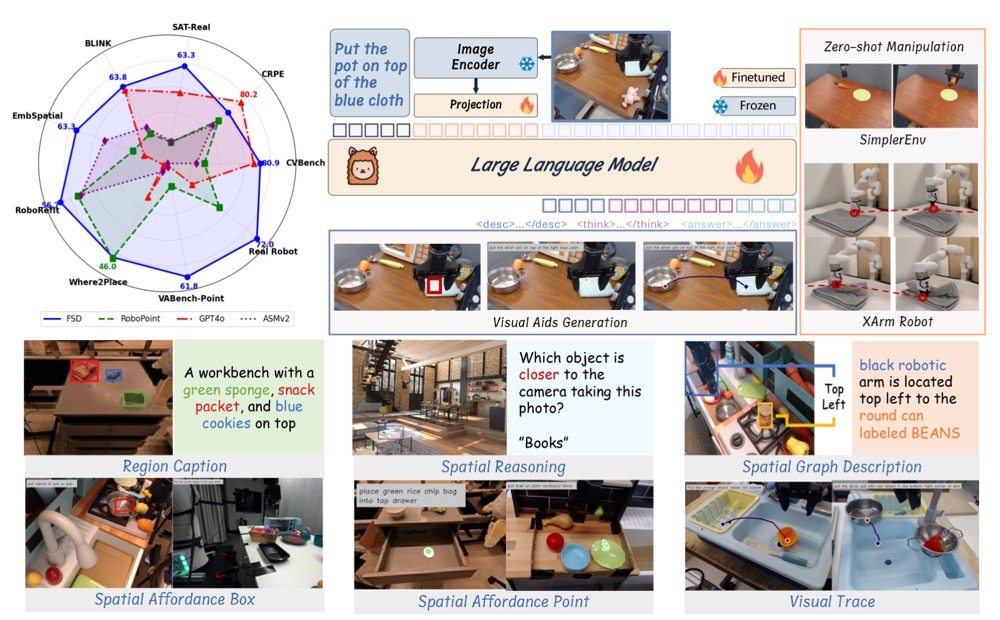
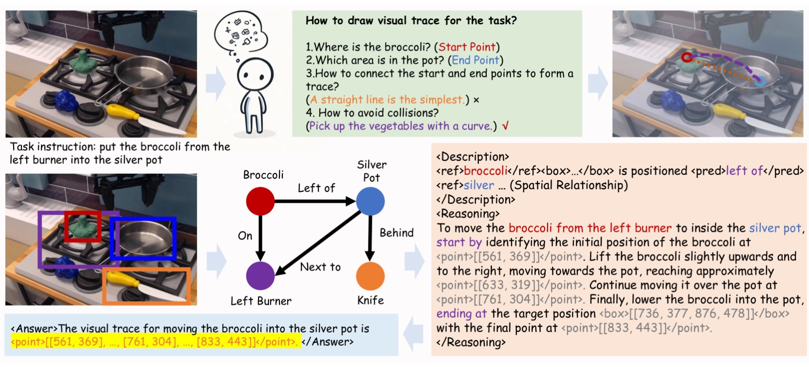
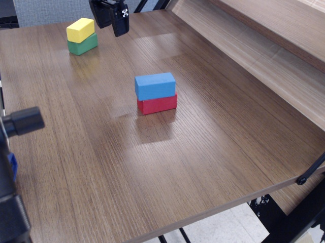
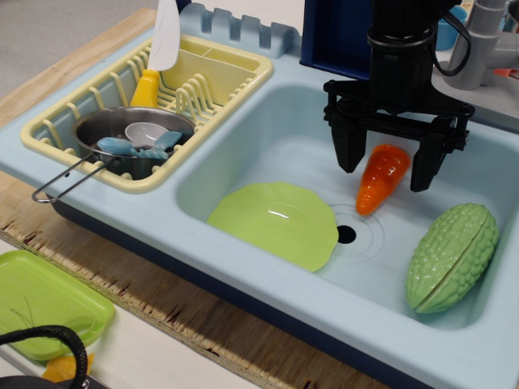
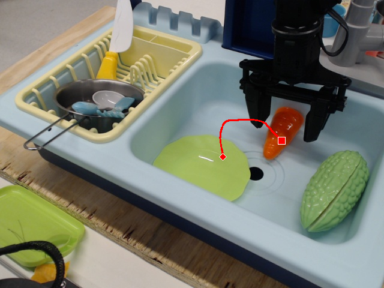
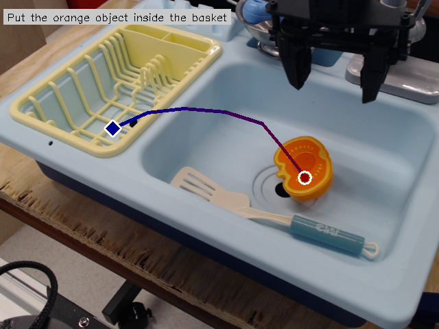

# From Seeing to Doing: Bridging Reasoning and Decision for Robotic Manipulation (Embodied-FSD) [ICLR 2026]

<div align="center">

**From Seeing to Doing: Bridging Reasoning and Decision for Robotic Manipulation**

**ICLR 2026**

[[🌐 Website](https://embodied-fsd.github.io)] [[📄 Paper](https://arxiv.org/pdf/2505.08548)] [[🤗 Models](https://huggingface.co/collections/IffYuan/fsd-683fa0d552e70f302fd04b34)] [[🎯 Datasets](https://huggingface.co/collections/IffYuan/fsd-683fa0d552e70f302fd04b34)] [[💬 Demo](#demo)]

</div>

---

## 📖 Introduction 

We present **FSD (From Seeing to Doing)** with:

***[Embodied-FSD Model](https://huggingface.co/collections/IffYuan/fsd-683fa0d552e70f302fd04b34)***: We develop FSD, a novel vision-language model that generates intermediate representations through spatial relationship reasoning, providing fine-grained guidance for robotic manipulation. It integrates Spatial Relationship-Focused Chain-of-Thought (Sr-CoT) reasoning while maintaining powerful general capabilities.

***[VABench](https://huggingface.co/collections/IffYuan/fsd-683fa0d552e70f302fd04b34)***: We propose VABench, a more challenging benchmark for evaluating visual aids generation capabilities in robotic manipulation scenarios.



Figure 1: Overview of FSD



Figure 2: Spatial relationship-focused reasoning process (SrCoT).

## 📰 News

- **[2026-01]** 🎉 Accepted to ICLR 2026!
- **[2025-07]** ⚡️ We have updated SIMPLER ENV branch and LLM-based evaluation!  
- **[2025-07]** 🔬 We have updated the detailed training, inference, and evaluation code and readme. VABench evaluation benchmark is officially released!
- **[2025-05]** 📝 Code repository is now public - welcome to try FSD for robotic manipulation!

## ⚙️ Setup (Same as LLaVA)

1. Clone this repository and navigate to Embodied-FSD folder
```bash
git clone https://github.com/haotian-liu/LLaVA.git
cd LLaVA
```

2. Install Package
```Shell
conda create -n llava python=3.10 -y
conda activate llava
pip install --upgrade pip  # enable PEP 660 support
pip install -e .
# we recommend transformers==4.31.0
pip install transformers==4.31.0
```

3. Install additional packages for training cases
```
pip install -e ".[train]"
pip install flash-attn --no-build-isolation
```

---

## 🚀 Inference 

### Affordance Point Example

Task instruction: Move the yellow block in the middle of the table.

**Before prediction (original image):**



**Run the example code:**
```bash
cd Embodied-FSD/
python affordance_point_inference_example.py
```

**After prediction (visualization result):**


### Visual Trace Example

Task instruction: put carrot on plate.

**Before prediction (original image):**



**Run the example code:**
```bash
cd Embodied-FSD/
python visual_trace_inference_example.py
```

**After prediction (visualization result):**



---

## 🎯 Training

We mainly use the LLaVA and ASMv2 codebases to develop FSD. We appreciate these excellent works. The training process of FSD is divided into two stages: the first stage focuses on embodied reasoning and general spatial reasoning, while the second stage focuses on visual aids generation.

### Data Preparation

Please download the required datasets and organize them in `./data` from constituting datasets:

- COCO: [train2017](http://images.cocodataset.org/zips/train2017.zip), [train2014](http://images.cocodataset.org/zips/train2014.zip)
- GQA: [images](https://downloads.cs.stanford.edu/nlp/data/gqa/images.zip)
- OCR-VQA: [download script](https://drive.google.com/drive/folders/1_GYPY5UkUy7HIcR0zq3ZCFgeZN7BAfm_?usp=sharing), **we save all files as `.jpg`**
- TextVQA: [train_val_images](https://dl.fbaipublicfiles.com/textvqa/images/train_val_images.zip)
- VisualGenome: [part1](https://cs.stanford.edu/people/rak248/VG_100K_2/images.zip), [part2](https://cs.stanford.edu/people/rak248/VG_100K_2/images2.zip)
- CLEVR_v1.0: [images](https://dl.fbaipublicfiles.com/clevr/CLEVR_v1.0.zip)
- Visual7W: [images](http://vision.stanford.edu/yukezhu/visual7w_images.zip)
- Flickr30K: [images](https://hockenmaier.cs.illinois.edu/DenotationGraph/)
- SA-1B: [images](https://ai.meta.com/datasets/segment-anything/) (Only sa_000000-sa_000003)
- st_vqa(cauldron,llava_format), raven(cauldron), vsr(cauldron,llava_format), CLEVR-Math(MathV360K), Super-CLEVR(MathV360K): [FSD-Dataset](https://huggingface.co/datasets/IffYuan/FSD-Dataset/tree/main) (derived from LLaVA-OneVision-Data)
- kitti, 2d3ds: [FSD-Dataset](https://huggingface.co/datasets/IffYuan/FSD-Dataset/tree/main) (derived from SpatialQA)  
- object_ref, region_ref: [FSD-Dataset](https://huggingface.co/datasets/IffYuan/FSD-Dataset/tree/main) (derived from RoboPoint)  
- bridge_data_v2: [images](https://rail.eecs.berkeley.edu/datasets/bridge_release/data/) (derived from BridgeDataV2)
- droid: [FSD-Dataset](https://huggingface.co/datasets/IffYuan/FSD-Dataset/tree/main) (derived from DROID)  
- rtx: [FSD-Dataset](https://huggingface.co/datasets/IffYuan/FSD-Dataset/tree/main) (derived from Open-Embodidedment-X)  

After downloading all datasets, organize the data as follows in `./data`:

```
├── coco
│   ├── train2014
│   └── train2017
├── gqa
│   └── images
├── ocr_vqa
│   └── images
├── textvqa
│   └── train_images
└── vg
│   ├── VG_100K
│   └── VG_100K_2
├── CLEVR_v1.0
│   └── images
├── Visual7W
│   └── images
├── flickr30k
│   └── images
├── sam
│   ├── sa_000000
│   ├── sa_000001
│   ├── sa_000002
│   └── sa_000003
├── st_vqa(cauldron,llava_format)
├── raven(cauldron)
├── vsr(cauldron,llava_format)
├── CLEVR-Math(MathV360K)
├── Super-CLEVR(MathV360K)
├── SAT_images
├── kitti
├── 2d3ds
├── bridge_data_v2
│   ├── bridge_data_v1
│   ├── bridge_data_v2
│   ├── flap
│   ├── rss
│   └── icra 
├── droid  
│   ├── ILIAD+j807b3f8+2023-05-11-17h-34m-39s
│   └── ...
├── rtx 
│   ├── fractal20220817_data
│   ├── ucsd_kitchen_dataset_converted_externally_to_rlds
│   ├── jaco_play 
│   └── ucsd_pick_and_place_dataset_converted_externally_to_rlds         
├── object_ref
├── region_ref
```

### Stage1: General Embodied/Spatial Reasoning

In this stage, we train the model to enhance spatial reasoning ability. We finetune the FSD model based on the [ASMv2](https://github.com/OpenGVLab/all-seeing).

The JSON data used in Stage 1: [Dataset Link](https://huggingface.co/datasets/IffYuan/FSD-Dataset/blob/main/data/FSD-Stage1-Dataset.json)

```shell
# Stage 1: spatial reasoning
bash scripts_fsd/stage1-fsd.sh
```

### Stage2: Robotics-Focused Fine-tuning

In this stage, we enhance the model with robotics manipulation data and advanced visual aids generation.

The JSON data used in Stage 2: [Dataset Link](https://huggingface.co/datasets/IffYuan/FSD-Dataset/blob/main/data/FSD-Stage2-Dataset.json)

```shell
# Stage 2: visual aids generation
bash scripts_fsd/stage2-fsd.sh
```

## 📊 Weak-to-Strong Dataset

- [Level-1-2-3-Dataset](https://huggingface.co/datasets/IffYuan/FSD-Dataset/blob/main/data/Level-1-2-3-Dataset.json): FSD spatial reasoning dataset
- [Level-4-5-Dataset](https://huggingface.co/datasets/IffYuan/FSD-Dataset/blob/main/data/Level-4-5-Dataset.json): FSD visual aids generation dataset

As in ASMv2, in our dataset, we use <ref></ref> to annotate target objects and <pred></pred> to annotate spatial relations. Each bounding box is normalized to integer values within the range [0, 1000). **Note: When training and outputting coordinates, we first pad the image into a square and then output the normalized coordinates on the square image. Special attention should be paid to this conversion process.**

## 📝 Evaluation

We used the [lmms-eval](https://github.com/EvolvingLMMs-Lab/lmms-eval) framework to complete the evaluation of all benchmarks, and we are grateful for their outstanding work!

### VABench Evaluation

`vabench_point_dataset.parquet` and `vabench_visual_trace_dataset.parquet` are used for VABench-Point and VABench-Visual Trace, respectively. In the parquet files, the `instruction` column contains the task instructions, the `images` column contains the images, and the `answer` column contains the answers. When evaluating VABench-Point, we calculate the proportion of predicted points that fall within the answer bounding boxes as the accuracy. For VABench-Visual Trace, we compute the MAE and RMSE between the predicted trajectories and the ground-truth trajectories. Note that, to ensure fair comparison across images of different sizes, both the predicted results and the ground-truth results are converted to the 0-1000 normalized coordinate system of the padded images (since FSD predictions are already in this format, no conversion is needed for them).

We have also provided a method for evaluating visual trace generation using LLM-based evaluation. 

Step 1️⃣: Get Model Output 
```
Task instruction: Put the orange object inside the basket.
FSD output: 
<Description>The image shows an <ref>orange object</ref><box>[[622, 424, 763, 583]]</box> sitting in a blue sink. To the left of the sink is a <ref>yellow dish rack</ref><box>[[19, 174, 494, 477]]</box>. A white spatula is positioned in front of the orange object.\n
</Description>
<Reasoning>\nTo move the orange object into the yellow dish rack, start by identifying the current position of the orange object at <point>[[694, 540]]</point>. \nLift the object slightly upwards and to the left, moving towards the dish rack. \nThe path should curve gently to avoid any obstacles, passing through intermediate points like <point>[[639, 440]]</point> and <point>[[513, 340]]</point>. \nFinally, lower the object into the dish rack, ending at the target position <box>[[213, 273, 339, 419]]</box> with the final point at <point>[[257, 390]]</point>.
</Reasoning>
<Answer>The visual trace for placing the orange object into the yellow dish rack is \n<point>[[694, 540], [682, 515], [639, 440], [597, 377], [513, 340], [419, 330], [337, 343], [257, 390]]</point>.
</Answer>
```
Step 2️⃣: Visualization



Step 3️⃣: LLM Evaluation

We need to input prompts containing instructions along with visualized images, and have LLM perform the scoring. 

Here is the prompt:
```
You are an expert evaluator in robotic manipulation and visual reasoning. Your job is to assess the quality of predicted trajectories based on task instructions and visual inputs.

You are given:
- A task instruction describing an object manipulation task.
- An image showing a predicted trajectory.

**Note:**
- In the image, the red circle indicates the start point, and the blue diamond indicates the end point.
- The trajectory represents the predicted movement path of the manipulated object, not the robot or end-effector.
- You should **evaluate the predicted trajectory as a proposed motion for the object that is supposed to be moved**, based on the task instruction — **not based on the static positions of objects in the image**. The objects have not actually moved.

**Evaluation Criteria (listed in order of importance):**

1. **Task Alignment and Success (most important)**  
   - Does the trajectory clearly and accurately fulfill the task instruction?  
   - **The trajectory must start at the correct location and end at a target position that aligns with the task goal.**  
   - Large deviations in the starting or ending point (e.g., wrong object, wrong destination, or stopping short of the goal) should result in a low score, even if the rest of the trajectory is smooth.  
   - If the task is not accomplished (due to incorrect goal interpretation or spatial execution), the score should be low regardless of other qualities.

2. **Feasibility**  
   - Is the movement physically plausible, smooth, and continuous?  
   - Are there any unrealistic discontinuities, sharp turns, or impossible transitions?  
   - Even if the movement is feasible, it should not receive a high score if the task is not completed.

3. **Obstacle Avoidance / Safety**  
   - Does the trajectory reasonably avoid collisions with surrounding objects?  
   - Minor risks may be tolerated if the task is completed successfully, but major or clear collisions should reduce the score.

**Scoring Guideline:**
- If the task is **not accomplished**, or if the start or end point is significantly incorrect, the score should typically be **4 or below**.
- If the task is completed but the trajectory has issues (e.g., roughness, minor risk of collision), a score in the **6–8** range is appropriate.
- A **score of 9–10** should be given only when the trajectory clearly completes the task, with good start/end accuracy, smooth motion, and reasonable safety.

Based on these criteria, provide a single overall score from 1 (very poor) to 10 (excellent), reflecting how well the task is accomplished.

Respond strictly in the following format:
Score: <1-10>  
Explanation: <brief justification>

The task instruction is:  
{task_instruction}

Please give your response.
```

LLM Output:
```
Score: 10
Explanation: The trajectory starts at the orange object and ends inside the basket, accurately fulfilling the instruction to put the orange object inside the basket. The path is smooth, continuous, and physically plausible, with no sharp turns or unrealistic movements. There is no significant risk of collision with other objects. Task is fully accomplished with good safety and feasibility.
```

The complete visualization and evaluation code can be executed:
```bash
cd Embodied-FSD-Github/visual_trace_llm_score
python gpt_score_example.py
```

### SIMPLERENV Evaluation

We refer to the [SIMPLERENV FSD branch](https://github.com/hilookas/SimplerEnv/tree/fsd).

---

## 🙏 Acknowledgments

We sincerely thank the following outstanding open-source projects and research works, which have provided an important foundation and support for the development of FSD: 

- [LLaVA](https://github.com/haotian-liu/LLaVA)  
- [ASMv2](https://github.com/OpenGVLab/all-seeing)  
- [LLaVA-OneVision-Data](https://huggingface.co/datasets/lmms-lab/LLaVA-OneVision-Data)   
- [SpatialQA](https://github.com/Junjie-Ye/SpatialQA)  
- [RoboPoint](https://github.com/huijieZH/RoboPoint)  
- [BridgeDataV2](https://rail.eecs.berkeley.edu/datasets/bridge_release/)  
- [DROID](https://droid-dataset.github.io/)  
- [Open-X-Embodiment](https://robotics-transformer-x.github.io/)  

---

## 📜 License

This project is licensed under the Apache 2.0 License. For details, please see the [LICENSE](LICENSE) file.

---

## 📚 Citation

If you use FSD in your research, please cite our paper:
```
@article{yuan2026seeing,
  title={From seeing to doing: Bridging reasoning and decision for robotic manipulation},
  author={Yuan, Yifu and Cui, Haiqin and Chen, Yibin and Dong, Zibin and Ni, Fei and Kou, Longxin and Liu, Jinyi and Li, Pengyi and Zheng, Yan and Hao, Jianye},
  journal={The Fourteenth International Conference on Learning Representations},
  year={2026}
}

@article{yuan2026embodied,
  title={Embodied-r1: Reinforced embodied reasoning for general robotic manipulation},
  author={Yuan, Yifu and Cui, Haiqin and Huang, Yaoting and Chen, Yibin and Ni, Fei and Dong, Zibin and Li, Pengyi and Zheng, Yan and Hao, Jianye},
  journal={The Fourteenth International Conference on Learning Representations},
  year={2026}
}
```
